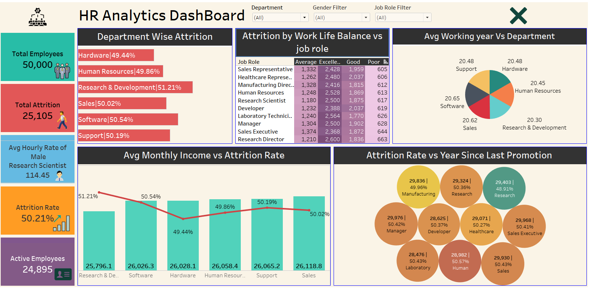

# HR Analytics with attrition

<h1>Aim</h1>To identify patterns and Potential factors that contribute to attrition and Understanding of Attrition Trends

<h1>Sources</h1>

<ul>
  <li>2 Excel Sheets : HR_1 And HR_2</li>
<li>Each Has 50,000  Rows</li>
</ul>

<h4>To understand Employee retention, I have created Tableau dashborad</h4>
Link: <a href="https://public.tableau.com/app/profile/sneha.deolikar/viz/HRAnalystFinal/DashboardFinal?publish=yes">https://public.tableau.com/app/profile/sneha.deolikar/viz/HRAnalystFinal/DashboardFinal?publish=yes</a>
<h1>Screenshot</h1>

<h1>Observation</h1>
<ol><li> Level of Employee Satisfaction and Engagement and Improvement for research and Development</li>
<li> Less hourly rate high attrition rate</li>
<li> lowest monthly income in R and D or any job dissatisfaction</li>
<li> Rapid Growth  and Rapid Evolving Technology in software</li>
<li> Balance Life is not Compromise but strategic investment</li>
<li> Lowest in Research Scientist and highest in Human Resource
It might be other factor such as job role, Monthly income, Overall Market Condition</li></ol>

<h1>Conclusion</h1>
To manage attrition , Extended work Hours over period can contribute to burnout and reduced job satisfaction
Attrition rate high then increase hourly rate 
To improve Involve salary analysis for competitiveness and retention programs

<h1>What I Learnt</h1>
<ul>
  <li>Create Interactive dashborad</li>
  <li>Understood Combine two Table with Join</li>
  <li>Used Calculated field for formulas with various condition</li>
  <li>Used the Filters</li>
  <li>creating set</li>
  <li>Used Varies Charts pie chart,bubble chart,heat map</li>
  <li>Using dual axis create clustered chart</li>
</ul>

